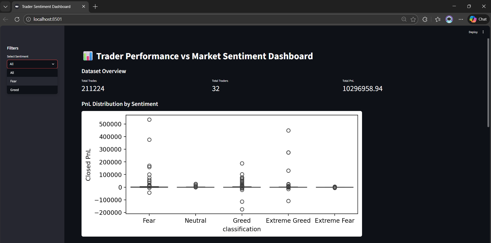
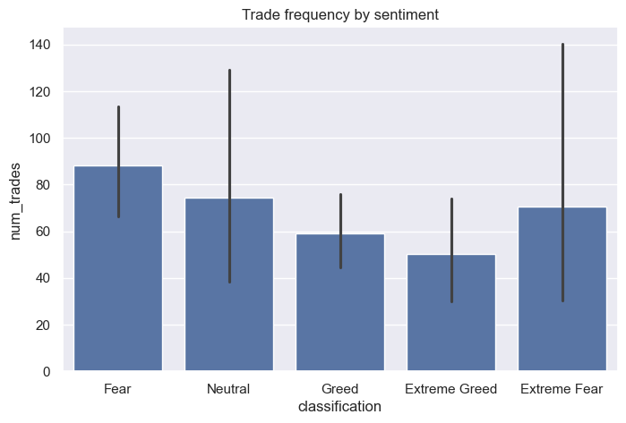

# 📊 Trader Performance vs Market Sentiment Analysis

## 📌 Objective
This project analyzes how Bitcoin market sentiment (Fear vs Greed) influences trader behavior and performance on Hyperliquid.  
The goal is to identify patterns that can help improve trading strategies and risk management.

---

## 🗂️ Dataset Used
1. Bitcoin Market Sentiment Dataset (Fear/Greed index)
2. Hyperliquid Historical Trader Dataset

---

## ⚙️ Project Workflow
### 1. Data Preparation
- Loaded and cleaned both datasets
- Handled missing values and duplicates
- Converted timestamps and aligned both datasets by date
- Created daily trader metrics:
  - Daily PnL per trader
  - Average trade size
  - Number of trades per day
  - PnL volatility and total PnL
  - Sentiment mapping (Fear vs Greed)

### 2. Exploratory Data Analysis
- Compared trader profitability across Fear vs Greed sentiment
- Analyzed trading frequency and position sizes
- Observed behavioral changes under different market sentiments
- Visualized results using boxplots and bar charts

### 3. Trader Segmentation
Traders were grouped into behavioral segments:
- Conservative traders (low risk, stable returns)
- Aggressive traders (high risk, high reward)
- Overtraders (high frequency, inconsistent returns)

### 4. Predictive Modeling (Bonus)
A RandomForest model was built to predict trader profitability using:
- Trade size
- Trade frequency
- PnL volatility
- Total PnL
- Market sentiment

**Model Accuracy:** ~68%

### 5. Streamlit Dashboard (Bonus)
A lightweight interactive dashboard was created to visualize:
- PnL distribution by sentiment
- Trade frequency patterns
- Position size behavior
- Overall dataset insights

Run dashboard locally:
 streamlit run dashboard.py

## 📈 Key Insights
- Market sentiment significantly affects trader profitability
- Fear periods show higher volatility and overtrading behavior
- Large position traders have high risk and reward outcomes
- Behavioral segmentation helps identify risk-prone traders

---

## 💡 Strategy Recommendations
- Reduce leverage and position size during Fear sentiment
- Use sentiment as a risk management indicator
- Limit overtrading during volatile market conditions
- Apply adaptive strategies for different trader segments

---

## 🛠️ Tech Stack
- Python
- Pandas
- Matplotlib & Seaborn
- Scikit-learn
- Streamlit

---

## ▶️ How to Run Project
1. Install dependencies:
  pip install -r requirements.txt

2. Run Jupyter notebook:
  notebook/trader_sentiment_analysis.ipynb

3. Run dashboard:
  streamlit run dashboard.py

## 📸 Project Screenshots

### Dashboard Preview

### Analysis Notebook Charts

## 👤 Author
A Bhanu Prakash  
Final Year CSE (AI/ML & Data Science Enthusiast)
